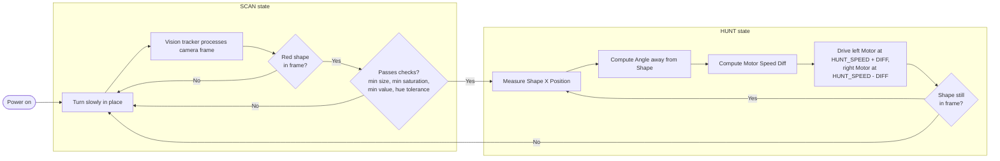

# PIE 3 Final Repository

```mermaid
flowchart LR
    Start([Power on]) --> Scan

    subgraph SCAN["SCAN state"]
        Scan[Turn slowly in place] --> Process[Vision tracker processes camera frame]
        Process --> Detect{Red shape<br/>in frame?}
        Detect -- No --> Scan
        Detect -- Yes --> Checks{Passes checks?<br/>min size, min saturation,<br/>min value, hue tolerance}
        Checks -- No --> Scan
    end

    Checks -- Yes --> Measure

    subgraph HUNT["HUNT state"]
        Measure[Measure Shape X Position] --> Angle[Compute Angle away from Shape]
        Angle --> Diff[Compute Motor Speed Diff]
        Diff --> Drive[Drive left Motor at HUNT_SPEED + DIFF,<br/>right Motor at HUNT_SPEED - DIFF]
        Drive --> InFrame{Shape still<br/>in frame?}
        InFrame -- Yes --> Measure
    end

    InFrame -- No --> Scan
```
